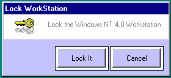



## Lock WorkStation WINNT 4\.0

### Description

This will actually lock a Winnt 4.0 workstation with 2 lines of code. Same ctrl-alt-dlt then Lock Workstation. There is not actually an API call to lock Winnt 4.0. Winlogon actually does it in code. I have found a way around it that works. It took me some time and quite a bit of research to come up with this. I've added some extra code to the project but it only takes 2 lines of code to lock it.

I will be enhancing this project to automatically prompt the user for a User name and Password or it will lock the desktop at random times (like right after start up, or you will be able to set the times.) This will keep anyone off of your computer that you don't want on it and even an Admin.

Please vote!! I've looked high and low and I know the code doen't exist anywhere else that's FREE.

Comments welcomed!
 
### More Info
 

             |
---                |---
**Submitted On**   |2001-06-19 13:37:48
**By**             |[Jesse E](https://github.com/Planet-Source-Code/PSCIndex/blob/master/ByAuthor/jesse-e.md)
**Level**          |Intermediate
**User Rating**    |5.0 (10 globes from 2 users)
**Compatibility**  |VB 5\.0, VB 6\.0
**Category**       |[Windows System Services](https://github.com/Planet-Source-Code/PSCIndex/blob/master/ByCategory/windows-system-services__1-35.md)
**World**          |[Visual Basic](https://github.com/Planet-Source-Code/PSCIndex/blob/master/ByWorld/visual-basic.md)
**Archive File**   |[Lock WorkS213596192001\.zip](https://github.com/Planet-Source-Code/jesse-e-lock-workstation-winnt-4-0__1-24220/archive/master.zip)

